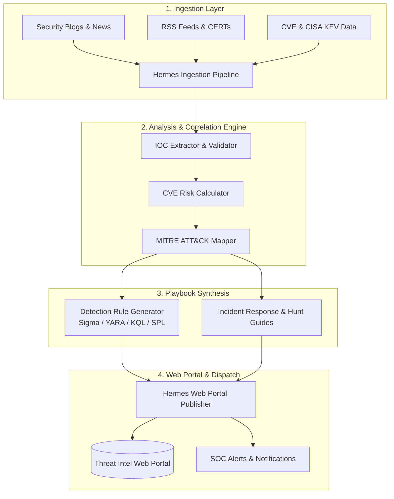

# ⚡ HERMES // Autonomous Threat Intelligence Engine

[](https://www.python.org/downloads/)
[](https://opensource.org/licenses/MIT)
[](https://attack.mitre.org/)
[]()

> **Hermes** is an autonomous, AI-driven Cyber Threat Intelligence (CTI) agent built to continuously monitor, extract, correlate, and publish actionable threat intelligence. Named after the messenger of the gods, Hermes scours global news events, RSS feeds, security blogs, vulnerability databases, and dark web/social intelligence streams 24/7—synthesizing raw noise into actionable defense capabilities.

---

## 🚀 Key Capabilities

### 🌐 1. Multi-Source Intelligence Ingestion
* **Global Feed Monitoring:** Scrapes and parses security vendor blogs, CERT advisories, CISA KEV feeds, Mastodon/X security channels, and RSS feeds daily.
* **Unstructured Text Extraction:** Converts raw HTML, PDFs, and blog posts into structured threat data using advanced natural language processing and regex engine parsers.

### 🧠 2. Deep Threat Analysis & Enrichment
* **Automated IOC Harvesting:** Extracts IPs, domains, hashes (MD5/SHA256), malicious URLs, and registry keys, automatically validating against OSINT sources (VirusTotal, AlienVault OTX, AbuseIPDB).
* **CVE & Zero-Day Scoring:** Correlates newly published vulnerabilities with EPSS scores, NVD metrics, and active exploitation telemetry to calculate real-world risk vectors.
* **MITRE ATT&CK® Mapping:** Maps extracted threat actor tactics, techniques, and procedures (TTPs) directly to the MITRE ATT&CK framework.

### ⚔️ 3. Actionable Defense Playbook Generation
* **Threat Hunting Queries:** Automatically generates production-ready detection rules in **Sigma**, **YARA**, **KQL**, and **Splunk SPL**.
* **Remediation & Incident Response Guides:** Produces step-by-step containment, isolation, and patching playbooks formatted for SOC analysts and incident response teams.

### 📰 4. Web Portal Publishing & CMS Sync
* **Automated Web Publishing:** Dynamically builds and updates a web portal hosting daily threat intelligence bulletins, interactive IOC search indexes, and playable security playbooks.
* **Real-time Alerting:** Dispatches immediate high-priority threat digests to security teams via Webhooks (Discord, Slack, Teams, Email).

---

## 🏗️ Architecture & Workflow



---

## 📂 Repository Blueprint

```
threat-intel-agent/
├── config/
│   ├── settings.yaml          # Feeds, API keys, and agent configuration
│   └── sources.json           # Curated target blogs, RSS, and CTI feeds
├── hermes/
│   ├── __init__.py
│   ├── ingestion/             # Scrapers, RSS readers, content extractors
│   │   ├── rss_parser.py
│   │   └── web_scraper.py
│   ├── analysis/              # IOC extraction, CVE enrichment, MITRE mapping
│   │   ├── ioc_extractor.py
│   │   ├── cve_analyzer.py
│   │   └── mitre_mapper.py
│   ├── playbooks/             # Rule generators (Sigma/YARA/KQL) & IR guides
│   │   ├── rule_generator.py
│   │   └── hunt_playbook.py
│   └── publisher/             # Web site generator & notification dispatchers
│       ├── site_builder.py
│       └── notifier.py
├── portal/                    # Web portal template & static assets
│   ├── index.html
│   └── assets/
├── tests/                     # Unit & integration tests
├── requirements.txt           # Python dependencies
├── main.py                    # Agent orchestration entrypoint
├── .gitignore                 # Environment & build exclusions
└── README.md                  # Project documentation
```

---

## ⚡ Quick Start

### Prerequisites
* **Python 3.10+**
* **Git**

### Installation

1. **Clone the repository:**
   ```bash
   git clone https://github.com/your-username/threat-intel-agent.git
   cd threat-intel-agent
   ```

2. **Set up virtual environment:**
   ```bash
   python3 -m venv .venv
   source .venv/bin/activate  # On Windows: .venv\Scripts\activate
   ```

3. **Install dependencies:**
   ```bash
   pip install -r requirements.txt
   ```

4. **Run Hermes Agent:**
   ```bash
   python main.py --run-once
   ```

---

## 🛡️ Strategic Roadmap

- [ ] **Phase 1:** Core RSS ingestion, basic IOC regex extraction, and static Markdown report generation.
- [ ] **Phase 2:** Automated CVE correlation with EPSS scores & YARA/Sigma rule generation engine.
- [ ] **Phase 3:** Full web portal auto-publishing pipeline with interactive search engine for IOCs.
- [ ] **Phase 4:** Multi-agent LLM reasoning for deep-dive threat actor profiling and proactive hunt playbook synthesis.

---

## 📜 License & Ethical Notice

Distributed under the MIT License. See `LICENSE` for more information.

> **Disclaimer:** Hermes is designed strictly for defensive cybersecurity operations, threat intelligence research, and SOC automation. Ensure proper authorization when querying external threat feeds or testing detection rules.
