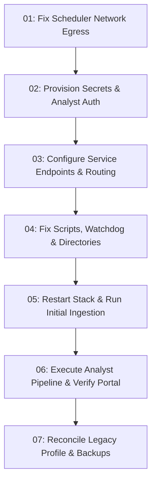

# CTI-Hermes Remediation & Launch Plan (`cti-homstretch`)

This directory contains self-contained, sequentially numbered prompts designed to fix all issues preventing the Hermes agents from populating data into the CTI application database and portal.

Each prompt is completely self-contained with:
- **Context & Diagnosis**: The exact files, configuration settings, and error logs involved.
- **Actionable Step-by-Step Instructions**: Exact file modifications and shell commands.
- **Verification Commands & Expected Outputs**: Specific commands to confirm the fix works.
- **Acceptance Criteria**: Pass/fail gates before moving to the next stage.

---

## Execution Sequence & Dependency Map

---

## Prompt Index

| Step | Prompt File | Scope & Objective |
| :--- | :--- | :--- |
| **01** | [`01-fix-scheduler-network-egress.md`](file:///home/cptcoggsworth/code/threat-intel-agent/cti-homstretch/01-fix-scheduler-network-egress.md) | Grant the Docker `scheduler` container internet egress so it can fetch public threat feeds. |
| **02** | [`02-provision-secrets-and-analyst-auth.md`](file:///home/cptcoggsworth/code/threat-intel-agent/cti-homstretch/02-provision-secrets-and-analyst-auth.md) | Generate `analyst-token`, mount it in `web`, configure profile credentials, and resolve API 404 fail-closed behavior. |
| **03** | [`03-configure-service-endpoints-and-routing.md`](file:///home/cptcoggsworth/code/threat-intel-agent/cti-homstretch/03-configure-service-endpoints-and-routing.md) | Align host resolution and Nginx port routing (Tailscale 9443/9444 and loopback 18000). |
| **04** | [`04-fix-scripts-watchdog-and-directories.md`](file:///home/cptcoggsworth/code/threat-intel-agent/cti-homstretch/04-fix-scripts-watchdog-and-directories.md) | Fix script syntax bugs, watchdog path duplication in cron, and create `portal/analyst-output`. |
| **05** | [`05-restart-stack-and-run-initial-ingestion.md`](file:///home/cptcoggsworth/code/threat-intel-agent/cti-homstretch/05-restart-stack-and-run-initial-ingestion.md) | Restart Compose stack, execute `hermes-cti db run-daily`, populate PostgreSQL, and clear monitor failure loop. |
| **06** | [`06-execute-analyst-pipeline-and-verify-portal.md`](file:///home/cptcoggsworth/code/threat-intel-agent/cti-homstretch/06-execute-analyst-pipeline-and-verify-portal.md) | Trigger `cti-analyst` run, submit proposals/reports to API, and verify dynamic portal renders intelligence. |
| **07** | [`07-reconcile-legacy-default-profile-and-backups.md`](file:///home/cptcoggsworth/code/threat-intel-agent/cti-homstretch/07-reconcile-legacy-default-profile-and-backups.md) | Align legacy flat-file cron job and fix LLM model identifier for daily backups. |

---

## Quick Reference: Key Components & Locations

- **CTI Application Code**: [`src/hermes_cti/`](file:///home/cptcoggsworth/code/threat-intel-agent/src/hermes_cti)
- **Deployment Config**: [`deploy/docker-compose.yml`](file:///home/cptcoggsworth/code/threat-intel-agent/deploy/docker-compose.yml)
- **Docker Secrets Root**: `/home/cptcoggsworth/.local/state/cti-hermes/secrets/`
- **Host Nginx Config**: [`/etc/nginx/sites-available/cti-hermes`](file:///etc/nginx/sites-available/cti-hermes)
- **Analyst Profile Root**: `~/.hermes/profiles/cti-analyst/`
- **Maintainer Profile Root**: `~/.hermes/profiles/cti-maintainer/`
- **Authoritative Source Registry**: [`config/sources.json`](file:///home/cptcoggsworth/code/threat-intel-agent/config/sources.json)
