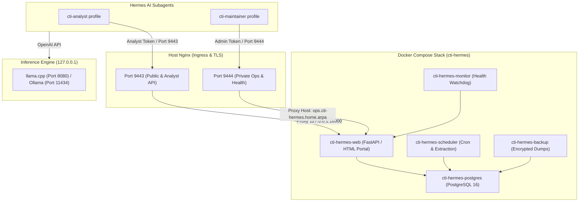

# CTI-Hermes Self-Hosting & Installation Guide

This guide provides step-by-step instructions for cloning the repository, provisioning file-backed secrets, spinning up the containerized CTI-Hermes services, configuring host Nginx with split-port TLS routing, setting up a local LLM inference engine (**llama.cpp** or **Ollama**), and connecting the **Hermes AI Agent** profiles.

---

## Table of Contents
1. [Architecture Overview](#architecture-overview)
2. [Prerequisites](#prerequisites)
3. [Step 1: Clone Repository & Local Environment](#step-1-clone-repository--local-environment)
4. [Step 2: Provision File-Backed Secrets & Environment](#step-2-provision-file-backed-secrets--environment)
5. [Step 3: Build & Launch the CTI Stack](#step-3-build--launch-the-cti-stack)
6. [Step 4: Set Up Local LLM Inference (llama.cpp or Ollama)](#step-4-set-up-local-llm-inference-llamacpp-or-ollama)
   - [Option A: llama.cpp Server (OpenAI-compatible)](#option-a-llamacpp-server-docker-or-native)
   - [Option B: Ollama](#option-b-ollama-docker-or-native)
7. [Step 5: Configure Host Nginx & TLS Termination](#step-5-configure-host-nginx--tls-termination)
8. [Step 6: Configure Hermes Agent Profiles](#step-6-configure-hermes-agent-profiles)
9. [Step 7: Automated Ingestion & Daily Operations](#step-7-automated-ingestion--daily-operations)
10. [Updating the Application](#updating-the-application)

---

## Architecture Overview



---

## Prerequisites

Ensure your host system (Linux / Ubuntu 22.04+ or Debian 12+ recommended) has the following packages installed:

* **Docker Engine** & **Docker Compose** (v2.20+)
* **Python** (v3.12+) and [**uv**](https://docs.astral.sh/uv/) (`curl -LsSf https://astral.sh/uv/install.sh | sh`)
* **Node.js** (v20+) & **npm** (for building Tailwind CSS assets)
* **Nginx** (installed on the host for SSL/TLS termination)
* **cURL**, **Git**, and **OpenSSL**

---

## Step 1: Clone Repository & Local Environment

```bash
# 1. Clone repository
git clone https://github.com/mrcoggsworth/threat-intel-agent.git
cd threat-intel-agent

# 2. Sync Python virtual environment with frozen lockfile
uv sync --frozen

# 3. Install frontend dependencies
npm install
```

---

## Step 2: Provision File-Backed Secrets & Environment

CTI-Hermes uses strict, file-backed secrets mounted into Docker containers with root-only read permissions (`0600`).

```bash
# 1. Generate secrets (admin-token, analyst-token, postgres password, backup key, etc.)
./scripts/setup-docker-secrets.sh

# By default, secrets are saved to ~/.local/state/cti-hermes/secrets/
# To verify:
ls -la ~/.local/state/cti-hermes/secrets/
```

### Optional: Configure Threat Enrichment API Keys
To enable live external enrichment (VirusTotal, AlienVault OTX, AbuseIPDB, NVD), write your API keys to the secrets directory:

```bash
echo "YOUR_VIRUSTOTAL_KEY" > ~/.local/state/cti-hermes/secrets/virustotal-api-key
echo "YOUR_OTX_KEY"         > ~/.local/state/cti-hermes/secrets/otx-api-key
echo "YOUR_ABUSEIPDB_KEY"   > ~/.local/state/cti-hermes/secrets/abuseipdb-api-key
echo "YOUR_NVD_KEY"         > ~/.local/state/cti-hermes/secrets/nvd-api-key
```

### Prepare Production Environment Configuration
```bash
sudo mkdir -p /opt/cti-hermes/env
sudo cp deploy/.env.example /opt/cti-hermes/env/production.env
sudo chown -R $USER:$USER /opt/cti-hermes
```

---

## Step 3: Build & Launch the CTI Stack

Run the built-in update/deploy script to compile CSS assets, build the container image, run Alembic migrations, recreate services, and verify healthchecks:

```bash
./scripts/update-app.sh
# or: npm run update
```

### Verify Container Health
```bash
docker ps --filter "name=cti-hermes"
```

All 5 core containers (`cti-hermes-web-1`, `cti-hermes-scheduler-1`, `cti-hermes-postgres-1`, `cti-hermes-backup-1`, `cti-hermes-monitor-1`) should report `healthy` or `Up`.

---

## Step 4: Set Up Local LLM Inference (llama.cpp or Ollama)

Hermes agents use an OpenAI-compatible API to perform autonomous intelligence extraction, analysis, playbook generation, and quality reviews.

### Option A: llama.cpp Server (Docker or Native)

Using Docker with GPU acceleration:

```bash
# Example running llama-server container
docker run -d \
  --name llamacpp \
  --restart unless-stopped \
  --gpus all \
  -p 127.0.0.1:8080:8080 \
  -v /opt/models:/models \
  ghcr.io/ggerganov/llama.cpp:server \
  -m /models/Qwen2.5-Coder-14B-Instruct-Q4_K_M.gguf \
  --host 0.0.0.0 \
  --port 8080 \
  -c 8192 \
  --api-key hermes-local-key
```

Test endpoint:
```bash
curl http://127.0.0.1:8080/v1/models -H "Authorization: Bearer hermes-local-key"
```

### Option B: Ollama (Docker or Native)

Install Ollama natively or with Docker:

```bash
# Install Ollama
curl -fsSL https://ollama.com/install.sh | sh

# Pull a high-performance CTI & coding model
ollama pull qwen2.5-coder:14b
# or: ollama pull mistral-small
```

Ollama automatically exposes an OpenAI-compatible API at `http://127.0.0.1:11434/v1`.

Test endpoint:
```bash
curl http://127.0.0.1:11434/v1/models
```

---

## Step 5: Configure Host Nginx & TLS Termination

Host Nginx manages TLS termination and separates **Public/Analyst** traffic (port 9443) from **Private Operations** traffic (port 9444).

1. Copy the example configuration template from [`deploy/host-nginx/cti-hermes`](deploy/host-nginx/cti-hermes):
   ```bash
   sudo cp deploy/host-nginx/cti-hermes /etc/nginx/sites-available/cti-hermes
   ```

2. Edit `/etc/nginx/sites-available/cti-hermes` to configure your server name, IP address, and TLS certificates (Let's Encrypt, Tailscale certs, or self-signed certs).

3. Enable the site configuration:
   ```bash
   sudo ln -s /etc/nginx/sites-available/cti-hermes /etc/nginx/sites-enabled/
   sudo nginx -t
   sudo systemctl reload nginx
   ```

4. Verify endpoint isolation:
   ```bash
   # Public portal liveness (200 OK)
   curl -k https://<YOUR_IP_OR_HOST>:9443/health/live

   # Public access to private readiness (Expect 404 Not Found)
   curl -k -i https://<YOUR_IP_OR_HOST>:9443/health/ready

   # Private access to readiness (Expect 200 OK)
   curl -k https://<YOUR_IP_OR_HOST>:9444/health/ready
   ```

---

## Step 6: Configure Hermes Agent Profiles

Hermes agent profiles allow AI agents to securely query the CTI API, trigger playbooks, and run threat hunt synthesis.

```bash
# Run guided Hermes profile setup
./scripts/install-hermes-profiles.sh --guided
```

This creates:
- `~/.hermes/profiles/cti-analyst/`
- `~/.hermes/profiles/cti-maintainer/`

Configure the runtime LLM endpoints in `~/.hermes/profiles/cti-analyst/.env`:
```ini
OPENAI_BASE_URL=http://127.0.0.1:8080/v1  # Or http://127.0.0.1:11434/v1 for Ollama
OPENAI_API_KEY=hermes-local-key
MODEL_NAME=Qwen2.5-Coder-14B-Instruct
HERMES_ANALYST_SERVICE_URL=https://127.0.0.1:9443
HERMES_ANALYST_SERVICE_TOKEN_FILE=/home/YOUR_USER/.local/state/cti-hermes/secrets/analyst-token
```

---

## Step 7: Automated Ingestion & Daily Operations

### 1. Trigger Initial Ingestion Run
To fetch all feeds from `config/sources.json`, extract IOCs/CVEs, and persist data:
```bash
docker exec cti-hermes-web-1 hermes-cti db run-daily
```

### 2. Verify Database Persistence
```bash
docker exec cti-hermes-postgres-1 psql -U hermes -d hermes -c "
SELECT 'source_document' AS table, count(*) FROM source_document
UNION ALL SELECT 'indicator', count(*) FROM indicator
UNION ALL SELECT 'evidence_claim', count(*) FROM evidence_claim;
"
```

### 3. Check Operations Status
```bash
ADMIN_TOKEN=$(cat ~/.local/state/cti-hermes/secrets/admin-token)
curl -s -H "X-Admin-Token: $ADMIN_TOKEN" -H "Host: ops.cti-hermes.home.arpa" http://127.0.0.1:18000/api/v1/ops/last-success
```

---

## Updating the Application

When pulling new git commits or modifying code:

```bash
git pull origin main
./scripts/update-app.sh
```

The updater will rebuild CSS, update the Docker image, run migrations, recreate the stack, and test service health in under 20 seconds.
