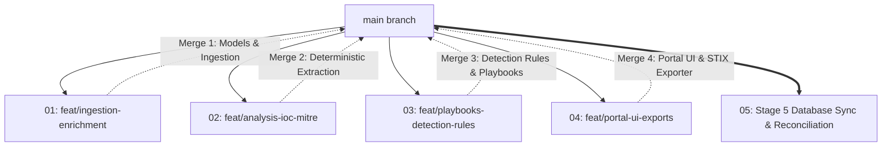

# Hermes CTI Feature Requests & Worktree Plans

This directory contains standalone, detailed implementation plans for each of the 4 parallel Git worktrees and the Stage 5 database reconciliation phase.

## Worktree Plan Index

| File | Branch | Worktree Path | Domain / Responsibility |
| :--- | :--- | :--- | :--- |
| [`01_feat_ingestion_enrichment.md`](file:///home/cptcoggsworth/code/threat-intel-agent/feature_requests/01_feat_ingestion_enrichment.md) | `feat/ingestion-enrichment` | `../threat-intel-agent-wt1` | Async RSS/Atom Ingestion, HTML/PDF Scraping, OSINT Enrichment (KEV, EPSS, AbuseIPDB, VT) |
| [`02_feat_analysis_ioc_mitre.md`](file:///home/cptcoggsworth/code/threat-intel-agent/feature_requests/02_feat_analysis_ioc_mitre.md) | `feat/analysis-ioc-mitre` | `../threat-intel-agent-wt2` | Deterministic IOC Extraction, Defanging/Refanging, CVE/EPSS Scoring, ATT&CK Matrix & Navigator Export |
| [`03_feat_playbooks_detection_rules.md`](file:///home/cptcoggsworth/code/threat-intel-agent/feature_requests/03_feat_playbooks_detection_rules.md) | `feat/playbooks-detection-rules` | `../threat-intel-agent-wt3` | Sigma YAML, Splunk SPL, KQL, YARA Signature Generators, Two-Tiered Hunt Playbooks, Rule Validators |
| [`04_feat_portal_ui_exports.md`](file:///home/cptcoggsworth/code/threat-intel-agent/feature_requests/04_feat_portal_ui_exports.md) | `feat/portal-ui-exports` | `../threat-intel-agent-wt4` | Static Site Builder, STIX 2.1 JSON Bundler, Webhook Notifiers, 1-Click SIEM Copy UI, EPSS Matrix |
| [`05_stage5_database_reconciliation.md`](file:///home/cptcoggsworth/code/threat-intel-agent/feature_requests/05_stage5_database_reconciliation.md) | `main` | Workspace Root | Database Migration, Live Ingestion, Memory Deduplication, `main.py --sync-db --rebuild-all` |

---

## Parallel Execution & Integration Flow

